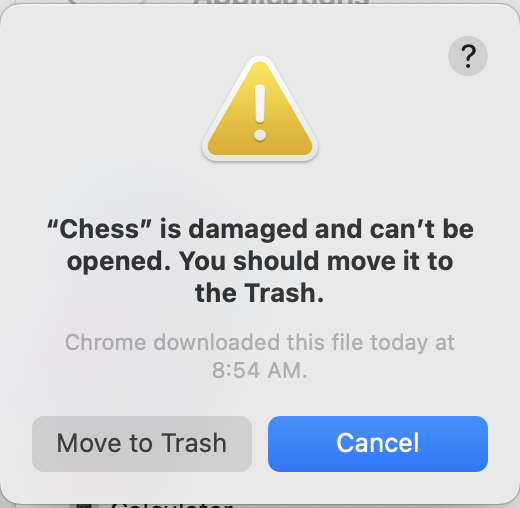
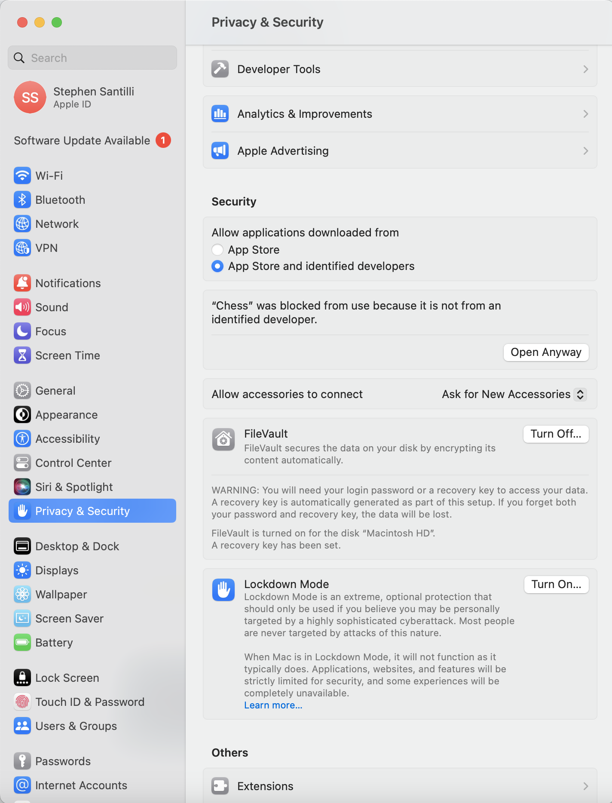

# Chess

## Mac - "Chess" is damaged and can't be opened. You should move it to the trash.

1. Open terminal
2. Enter `cd /Applications`
3. Enter `xattr -d com.apple.quarantine Chess.app`
4. Try to run the app
5. If it still won't run, open Settings and go to "Privacy and Security"
6. Find 
> "Chess" was blocked because it is not from an identified developer.

7. Then click "Open Anyway"
