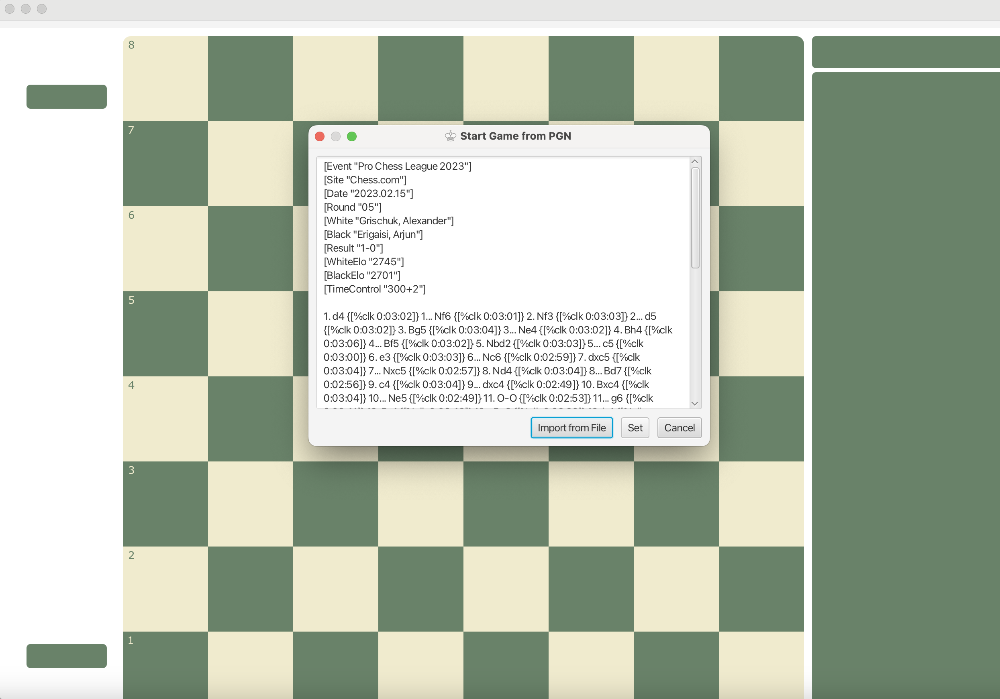

# Chess by Stephen Santilli
Chess was my final project submission for my Data Structures and Algorithms class at Fox Chapel Area High School. It is a fully functional Chess game coded in Java with many advanced features. The full, animated GUI is created using JavaFX.

## Features
- Cross platform support with installers
- Play two player via pass-and-play
- Multiplayer games across devices over Local Area Network (LAN)
- Games against against every Chess engine, using the Universal Chess Interface (UCI) format
- All standard chess rules enforced, including: piece move paths, castling, promotion, en passant, etc.
- Automatic check, checkmate, stalemate, insufficent material, no possible checkmate, draw by reptition, etc. detection
- Full game move history
    - View old board positions by clicking on that move
    - Move undo and redo
- Timer
    - Auto-flipping
    - Automatic game end when time runs out
    - Time per side as well as adding time after each move
- Load games from PGN or FEN notations
- Save and export games to PGN or FEN notations
- Chess960 support, random position generator that follows Chess960 standard
- Recognizes the current opening being played and displays the name of it
- And more!

## Known Issues

### Mac Only - "Chess" is damaged and can't be opened. You should move it to the trash.

1. Open terminal
2. Enter `cd /Applications`
3. Enter `xattr -d com.apple.quarantine Chess.app`
4. Try to run the app
5. If it still won't run, open Settings and go to "Privacy and Security"
6. Find 
> "Chess" was blocked because it is not from an identified developer.

7. Then click "Open Anyway"

## Libraries, Software, and Concepts Used
- Java
- GUI & UX
    - JavaFX
- Networking
    - LAN
- Multiplayer gaming
- Build tools
    - Gradle
- Object-Oriented Programmning

## Screenshots

There is a chess board with pieces, captured piece indicators, full, numbered move history, the squares that the piece in the previous move moved to and from are highlighted, the opening used in the game is identified and displayed, each player has a custom name, the draw is indicated in the move list by `1/2-1/2` etc.

There are inputs for player names & color selection (or random); gameplay type (pass-and-play, multiplayer, engine;) time controls; importing games (via FEN or PGN); and more.

You can import games using the Portable Game Notation (PGN) standard format by either pasting them in this dialog or browsing for a file using the file explorer.

The game will automatically detect game-ending positions and present the user with a dialog that the game is over, as well as stopping the timers. The move history can still be accessed even once the game is over by clicking `OK`, allowing the user to analyze the game.